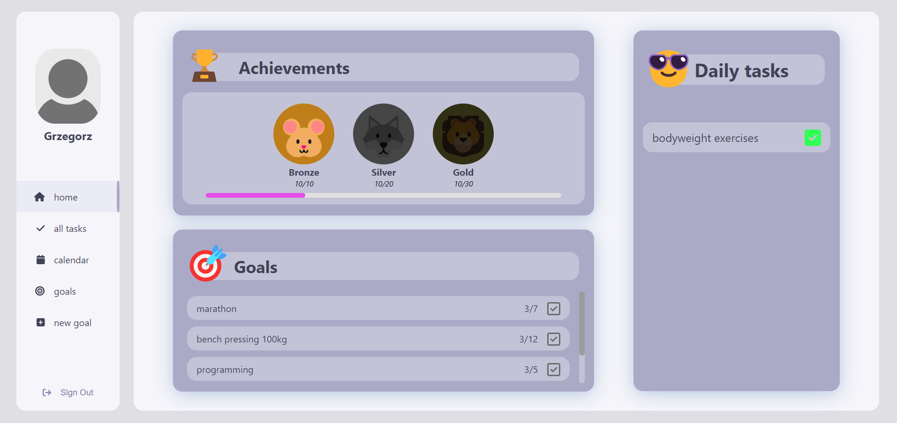
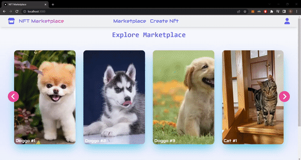

<!-- Welcome Section -->

    
🎉 Welcome to My Portfolio 🎉

<!-- About Me Section -->

    <h2 style="color: #333;">Hi there 👋</h2>
    
I'm a Java Fullstack Developer. I graduated from the <strong>Polish-Japanese Academy of Information Technology</strong> with both a Bachelor's and a Master's degree. My education and passion for technology have driven me to work on some fascinating projects, particularly in the fields of Blockchain Technology and Artificial Intelligence.

    

<!-- Education Section -->

    <h2 style="color: #333;">🎓 Education</h2>
    <ul style="font-size: 1.1rem; color: #555;">
        <li><strong>Master's Degree in Engineering</strong> - Polish-Japanese Academy of Information Technology</li>
        <li><strong>Bachelor's Degree in Engineering</strong> - Polish-Japanese Academy of Information Technology</li>
    </ul>

<!-- Skills Section -->

    <h2 style="color: #333;">💻 Skills</h2>
    <ul style="font-size: 1.1rem; color: #555;">
        <li><strong>Languages:</strong> Java, Python, TypeScript, HTML, CSS</li>
        <li><strong>Frameworks:</strong> Spring Boot, React, Angular</li>
        <li><strong>Databases:</strong> PostgresSQL, MongoDB</li>
        <li><strong>Tools & Platforms:</strong> TailwindCSS, Git, Docker, Kubernetes</li>
        <li><strong>Others:</strong> Blockchain Technology, Artificial Intelligence</li>
    </ul>

<!-- Projects Section -->

    <h2 style="color: #333;">🚀 Projects</h2>
    <h3 style="color: #555;">🤖 Artificial Intelligence Project - selfimprovement.ai</h3>
    
    
<a href="https://github.com/Grzegorz00/selfimprovement.ai" style="color: #0073e6; text-decoration: none;">Repository: selfimprovement.ai</a>

    <h3 style="color: #555;">🔗 Blockchain Project - nft-marketplace</h3>
    
    
<a href="https://github.com/Grzegorz00/nft-marketplace" style="color: #0073e6; text-decoration: none;">Repository: nft-marketplace</a>

<!-- Contact Section -->

    <h2 style="color: #333;">📬 Contact</h2>
    <ul style="list-style: none; padding: 0; font-size: 1.1rem; color: #555;">
        <li style="margin: 0.5rem 0;"><strong>Email:</strong> <a href="mailto:grzegorz.swiecicki00@gmail.com" style="color: #0073e6; text-decoration: none;">grzegorz.swiecicki00@gmail.com</a></li>
        <li style="margin: 0.5rem 0;"><strong>LinkedIn:</strong> <a href="https://www.linkedin.com/in/gswiecicki/" target="_blank" style="color: #0073e6; text-decoration: none;">My LinkedIn Profile</a></li>
    </ul>
    
Thank you for visiting my portfolio! I'm always open to discussing new opportunities and collaborations.

